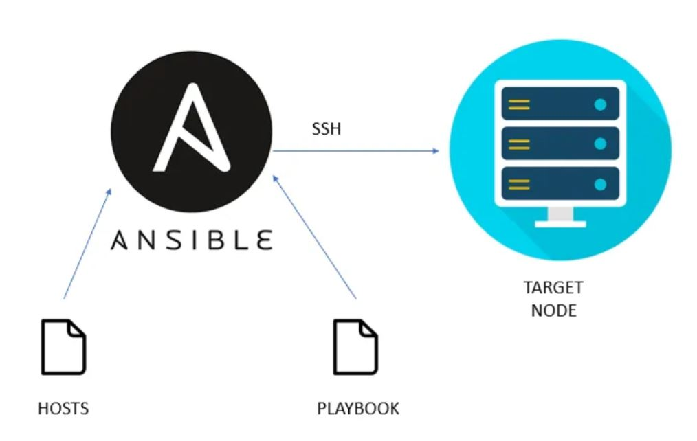
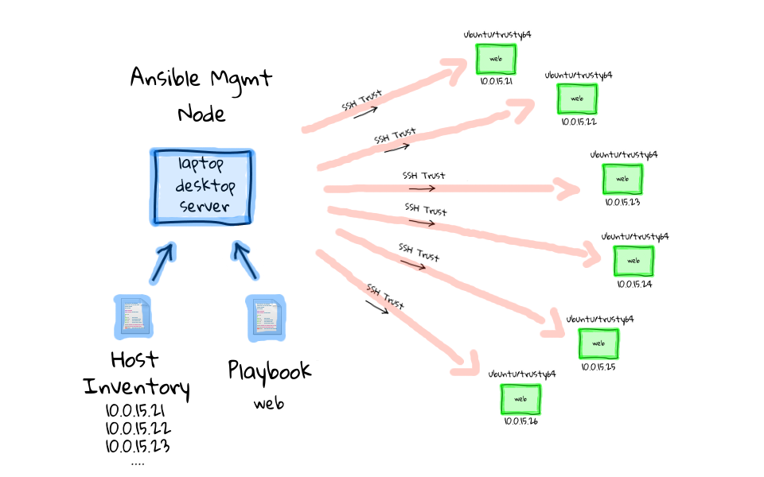

<h1 align="center" style="color: red;">Introduction à Ansible et Setup de l'Environnement</h1>

## Introduction
👋 Dans cette section, nous allons vous guider à travers les étapes nécessaires pour installer Ansible et configurer votre environnement.

## Qu'est-ce qu'Ansible ?
Ansible est un outil d'automatisation qui facilite la gestion des serveurs et des applications. Il est "sans agent", ce qui signifie qu'il n'a pas besoin d'un logiciel spécial installé sur les machines que vous gérez. Il est populaire parce qu'il est simple à utiliser, efficace, et utilise des fichiers YAML faciles à comprendre.
<p align="center">
  
</p>  

## Architecture d'Ansible
- `Serveur Ansible` :  
C'est l'ordinateur (un laptop, un PC ou un serveur) où Ansible est installé. Il contient :
- `Playbooks` :  
Ce sont des fichiers qui définissent ce que vous voulez faire (comme installer des logiciels ou configurer des paramètres).
- `Inventaire` :  
Une liste des serveurs que vous gérez, appelée "hôtes",Il sert aussi à organiser ces serveurs en groupes afin de faciliter la gestion et l'exécution des tâches.
-  `ansible.cfg` : Contient la configuration par défaut pour Ansible, 

## Playbooks :

- `Rôles` :  
Groupes de tâches organisées pour une fonction spécifique (par exemple, installer un serveur web).
- `Tâches` :  
 Ce sont les commandes individuelles que vous voulez exécuter (comme "installer nginx").

## SSH sans mot de passe : 
Ansible communique avec les serveurs cibles en utilisant SSH, sans nécessiter de mot de passe à chaque fois.

## Comment ça fonctionne ?
- Vous créez des playbooks et un inventaire sur votre machine locale.
- Vous établissez une connexion SSH sans mot de passe aux serveurs cibles.
- Ansible recueille des informations (gather facts) sur les serveurs cibles pour connaître leur état.
- Ansible envoie les instructions (playbooks) aux serveurs.
- Les serveurs exécutent les tâches définies dans les playbooks.

## Étapes de Configuration
<p align="center">
  
</p>  

### 1. Prérequis
Avant de commencer, assurez-vous d'avoir :
- 3 machines virtuels (1 control node & 2 target nodes) ayant les système Red Hat Enterprise Linux ou CentOS installé.
- le paquet python3 est installé sur les 3 machines.
```bash
yum install python3
```

### 2. Installer Ansible sous le control node.
```bash
yum install ansible-core
```
### 3. ajouter et configurer le 'remote user' sous les 3 machines.
```bash
useradd ansible
passwd ansible
```
```bash
vim /etc/sudoers.d/ansible
ansible     ALL=(ALL) 	NOPASSWD:ALL
```

NB: avant de commencer, vous pouvez nommer les machines comme suit.

```bash
vim /etc/hosts
control-node son@ip
target-node1 son@ip
target-node2 son@ip

```
### 4. configurer la connexion ssh sans mot de passe depuis le control node en tant que remote user vers les 2 machines.
```bash
ssh ansible@localhost
ssh-keygen
ls .ssh
ssh-copy-id target-node1
ssh-copy-id target-node2
```
### 5. ajouter le fichier inventaire sous le control node
```bash
[group1]
client-node1

[group2]
client-node2
```
### 6. ajouter le fichier ansib sous le control node
[defaults]
remote_user=ansible
inventory=/home/ansible/inventory

### 7. tester la connexion ssh sans mot de passe en restant en tant que remote user
```bash
ssh root@target-node1
```
NB: si vous aurez la probléme Permission denied ajouter ces trois paramétre dans le fichier de configuration /etc/ssh/sshd_config et 
```bash
PermitRootLogin yes
PasswordAuthentication yes
PubkeyAuthentication yes
```
```bash
systemctl restart sshd
```
### 5. tester la connexion ansible
```bash
ansible client-node1 -m ping
```


