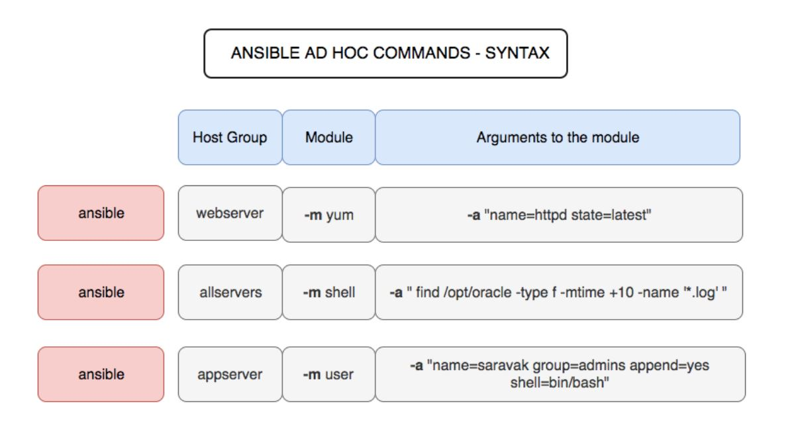

<h1 align="center" style="color: red;">Les commandes AD-HOC à Ansible</h1>

### Introduction
👋 Dans cette section, nous allons explorer comment utiliser la commande AD-HOC ansible.
## Syntaxe
`ansible <hosts> -m <module> -a <arguments> -i <inventory> [options]`
- `<hosts>` : Les hôtes sur lesquels la commande doit être exécutée. Cela peut être all ou un groupe d'hôtes défini dans votre fichier d'inventaire ou une adresse IP/un nom d'hôte spécifique.

- `-m <module>` : Le module Ansible à utiliser pour exécuter la tâche. Par exemple, le module ping, shell, command, copy, etc.
NB: Pour lister tous les modules
``` bash
ansible-doc -l
```
NB: Pour obtenir la documentation du module on fait 
``` bash
ansible-doc module_name
```
ansible-doc -l | grep user

- `-a <arguments>` : Les arguments à passer au module spécifié. La manière dont les arguments sont spécifiés dépend du module utilisé.

- `-i <inventory>` : Le fichier d'inventaire qui contient la liste des hôtes et leurs groupes. Si vous n'utilisez pas cette option, Ansible utilisera le fichier d'inventaire par défaut situé dans /etc/ansible/hosts.

[options] : D'autres options supplémentaires peuvent être spécifiées, comme -u <user> pour définir l'utilisateur SSH à utiliser, -b pour élever les privilèges (sudo), etc.

<p align="center">
  
</p>  

### LAB 00
1. Module `ping`
Ce module est utilisé pour tester la connexion entre Ansible et les hôtes cibles.
``` bash
ansible all -m ping 
``` 
2. Module `command`
Ce module exécute des commandes sur les hôtes cibles. Contrairement au module shell, il n'interprète pas les caractères spéciaux comme les redirections (>, |, etc.).
``` bash
ansible all -m command -a "ls -l /etc" 
``` 
3. Module `shell`
Ce module exécute des commandes dans le shell de l'hôte cible, permettant l'utilisation de caractères spéciaux et de redirections
``` bash
ansible all -m shell -a "echo $HOME > homes_directory" 
``` 
4. Module `copy`
Ce module copie des fichiers de la machine de contrôle Ansible vers les hôtes cibles.
``` bash
ansible all -m copy -a "src=/path/to/local/file dest=/path/to/remote/destination" 
```
5. Module `file`
Ce module gère les fichiers et répertoires sur les hôtes cibles, permettant la création, la suppression et la modification des permissions.  
exemple: ajouter un répertoire.
``` bash
ansible all -m file -a "path=/path/to/directory state=directory"
```
6. Module `lineinfile`
ajouter, supprimer ou modifier des lignes sans affecter le reste du contenu.
exemple: ajouter une ligne.
``` bash
ansible all -i inventory -m lineinfile -a "path=/etc/fstab line='/dev/sdb1 /mnt/data ext4 defaults 0 0'"
```
7. Module `yum`
Ce module gère les packages sur les systèmes basés sur Red Hat (utilisant yum).
exemple: installer un package
``` bash
ansible all -m yum -a "name=httpd state=present" 
```
8. Module `service`
Ce module gère les services sur les hôtes cibles.
example: restart le service
``` bash
ansible all -m service -a "name=httpd state=restarted" 
```
9. Module `group`
Le module group permet de gérer les groupes sur les hôtes cibles.
exemple: ajouter un groupe
``` bash
ansible all -m group -a "name=developers  gid=2002 state=present" 
```
10. Module `user`
exemple: ajouter un utilisateur
``` bash
ansible all -m group -a "name=developer uid=2001 state=present"
```
### LAB 01
#### Q0. Exécutez une commande ad hoc pour ajouter un utilisateur nommé « lisa » puis observez la sortie de la commande en utilisant la commande ad-hoc
<!--
```bash
ansible all -m user -a "name=lisa"
ansible all -m command -a "tail -1 /etc/passwd"
```
-->
#### Q1. Modifiez l'utilisateur « lisa » pour que son shell soit /sbin/nologin, que son UID soit 2005 et que son home directory soit /home/lisa.
<!--
```bash
ansible all -m user -a "name=lisa shell=/sbin/nologin uid=2005 home=/home/lisa"

```
-->
#### Q2. Supprimez maintenant l’utilisateur lisa de toutes les machines hôtes 
<!--
```bash
ansible all -m user -a "name=lisa state=absent"

```
-->
#### Q3. Installez le package httpd dans la machine hôte target-node1.
<!--
```bash
ansible target-node1 -m yum -a "name=httpd state=present"

```
-->
#### Q4. Vérifiez l’installation du package httpd dans toutes les machines en utilisant le module command
<!--
```bash
ansible all -m command -a "rpm -q httpd"

```
-->
#### Q5. Démarrez et activez maintenant le service httpd dans la machine hôte
<!--
```bash
ansible target-node1 -m service -a "name=httpd state=started enabled=yes"

```
-->
#### Q6. Utilisez le module service pour vérifier l’état de httpd sur tous les machines
<!--
```bash
ansible all -m service -a "name=httpd state=started"


```
-->
#### Q7. Utilisez le module lineinfile pour ajouter une ligne au fichier /etc/hosts sur toutes les machines hôtes. La ligne à ajouter est 192.168.1.100 newhost.
<!--
```bash
ansible all -m lineinfile -a "path=/etc/hosts line='192.168.1.100 newhost' state=present"


```
-->
#### Q8. Utilisez le module copy pour copier un fichier nommé index.html depuis la machine de contrôle vers le répertoire /var/www/html/ sur la machine target-node2.
<!--
```bash
ansible target-node2 -m copy -a "src=/index.html dest=/var/www/html/"


```
-->


#### Q10. Utilisez le module file pour créer un répertoire nommé /backup sur toutes les machines hôtes avec les permissions 0755, appartenant à l'utilisateur root et au groupe root.

<!--
```bash
ansible all -m file -a "path=/backup state=directory mode=0755 owner=root group=root"


```
-->
#### Q11. Ajoutez une ligne pour configurer le serveur SSH afin d'autoriser l'authentification par mot de passe dans le fichier /etc/ssh/sshd_config.
<!--
```bash
ansible all -m lineinfile -a "path=/etc/ssh/sshd_config line='PasswordAuthentication yes' state=present"

```
-->
#### Q12. Supprimez la ligne contenant l'adresse 192.168.1.100 dans /etc/hosts.
<!--
```bash
ansible all -m lineinfile -a "path=/etc/hosts regexp='^192.168.1.100' state=absent"

```
-->


