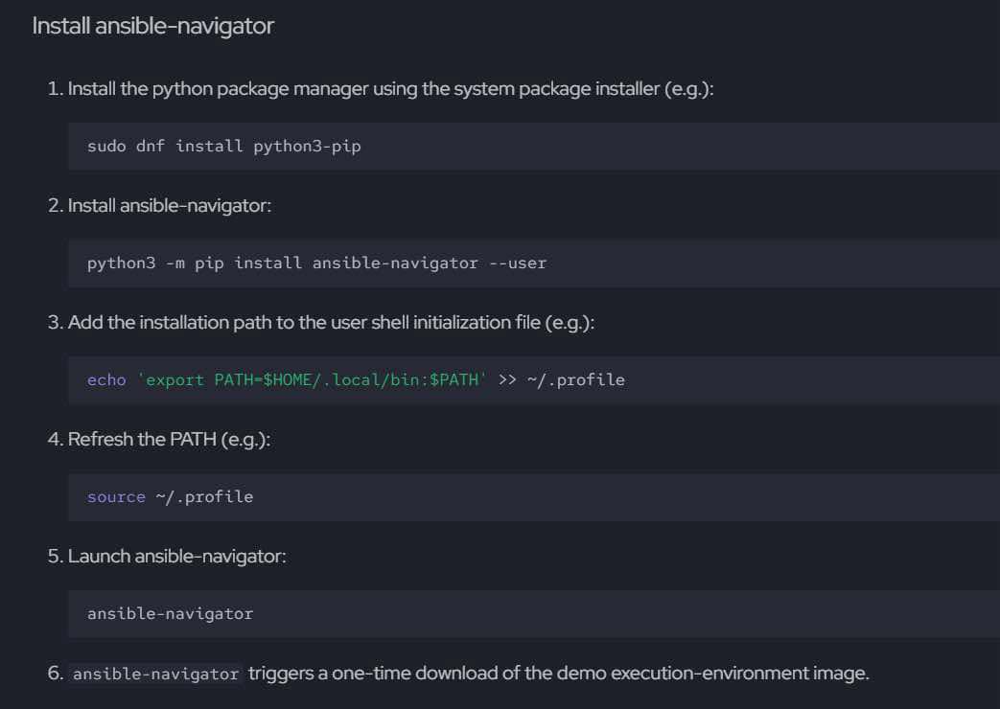

<h1 align="center" style="color: red;"> Configuration de Yum Repositories et Utilisation d'Ansible Navigator</h1>

## Introduction

👋 Dans cette section, l'objectif est de configurer des Yum Repositories sur plusieurs nœuds en utilisant Ansible, et d'expliquer comment utiliser Ansible Navigator pour gérer et exécuter les playbooks. Nous allons créer deux dépôts Yum : `baseos` et `appstream`, et démontrer comment exécuter des playbooks avec Ansible Navigator.

  
## Utilisation d'Ansible Navigator
0. **installer ansible navigator pou tester**:
  <p align="center">
  
</p>  
2. **Installer Ansible Navigator dans l'exam** :
    Pour installer Ansible Navigator, utilisez la commande suivante :
    ```bash
    sudo yum install ansible-navigator
    ```

3. **Connecter Podman (si nécessaire)** :
    Connectez-vous à votre registre Docker ou Podman si cela est requis pour la configuration:
    ```bash
    podman login registry.redhat.io
    username: ...
    password: ...
    ```
4. **tapez cette commande pour la configuartion auto de navigator** :
``` bash
ansible-navigator
```
4. **utilisez ansible-navigator pour l'éxecution de playbook** :
``` bash
ansible-navigator run NomPlaybook.yml -m stdout
```


## Configuration des Repositories Yum

Nous allons créer un playbook Ansible pour configurer deux dépôts Yum : **BaseOS** et **AppStream**.

### Création du playbook 

faire un playbook qui crée et configure les deux dépôts Yum sur tous les nœuds définis dans l'inventaire d'Ansible.  
Le playbook se compose de deux tâches principales :

1. **Créer le dépôt BaseOS** :
   - Nom : `baseos`
   - Description : `Baseos Description`
   - URL : `http://content/rhel9.0/x86_64/dvd/BaseOS`
   - GPG : Activé
   - Clé GPG : `http://content.example.com/rhel9.0/x86_64/dvd/RPM-GPG-KEY-redhatrelease`
   - Le dépôt est activé.

2. **Créer le dépôt AppStream** :
   - Nom : `appstream`
   - Description : `App Description`
   - URL : `http://content/rhel9.0/x86_64/dvd/AppStream`
   - GPG : Activé
   - Clé GPG : `http://content.example.com/rhel9.0/x86_64/dvd/RPM-GPG-KEY-redhatrelease`
   - Le dépôt est activé.

```yaml
vim yumrepo.yml

- name: Creating yum repository
  hosts: all
  tasks:
    - name: Create BaseOS Repository
      ansible.builtin.yum_repository:
        name: "baseos"
        description: "Baseos Description"
        baseurl: http://content/rhel9.0/x86_64/dvd/BaseOS
        gpgcheck: yes
        gpgkey: http://content.example.com/rhel9.0/x86_64/dvd/RPM-GPG-KEY-redhatrelease
        enabled: yes

    - name: Create Appstream Repository
      ansible.builtin.yum_repository:
        name: "appstream"
        description: "App Description"
        baseurl: http://content/rhel9.0/x86_64/dvd/AppStream
        gpgcheck: yes
        gpgkey: http://content.example.com/rhel9.0/x86_64/dvd/RPM-GPG-KEY-redhatrelease
        enabled: yes
```
