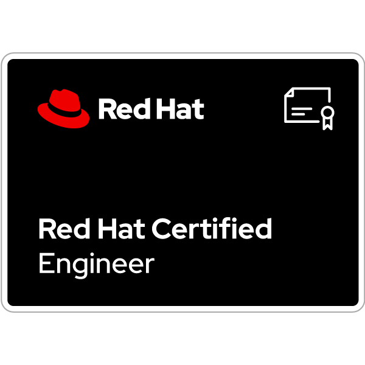

<h1 align="center">Formation RHCE</h1>

  

<h1 align="center">Automatisation Système avec Ansible sous Red Hat Enterprise Linux</h1>

## Introduction
👋 Bienvenue dans ce cours sur l'automatisation système avec Ansible sous Red Hat Enterprise Linux. 
Ce cours est conçu pour vous préparer à l'examen RHCE (Red Hat Certified Engineer)!

🔧 **Pourquoi ce cours ?**
- **Compétences Pratiques** : Apprenez à utiliser Ansible pour automatiser la gestion de systèmes Red Hat Enterprise Linux.
- **Certification Reconnue** : Obtenez la certification RHCE, reconnue mondialement et très recherchée par les employeurs.
- **Opportunités de Carrière** : Augmentez vos chances de décrocher des postes d'ingénieur DevOps, administrateur système, et bien d'autres.

📚 **Ce que vous allez apprendre :**
- **Installation et Configuration d'Ansible** : Déployez et configurez Ansible pour divers environnements.
- **Commandes Ad-Hoc et Playbooks** : Apprenez à utiliser les commandes ad-hoc et à créer des playbooks pour automatiser les tâches.
- **Gestion des Variables et des Facts** : Utilisez les variables, les facts et les variables magiques pour rendre vos playbooks plus dynamiques.
- **Gestion Avancée des Tâches** : Implémentez des conditions, des boucles, des handlers de tâches et des handlers d'erreurs.
- **Utilisation d'Ansible Galaxy et des Rôles** : Téléchargez des rôles à partir d'Ansible Galaxy et créez vos propres rôles pour organiser vos playbooks.
- **Gestion du Stockage avec Ansible** : Configurez et gérez le stockage avec Ansible.

🎯 **Objectifs du cours :**
1. Vous fournir les connaissances et les compétences nécessaires pour réussir l'examen RHCE.
2. Vous préparer à automatiser efficacement la gestion des systèmes Red Hat Enterprise Linux dans un environnement professionnel.
3. Développer votre expertise en automatisation système à travers des exercices pratiques et des labs interactifs.

🎓 **À qui s'adresse ce cours ?**
- **Administrateurs Système** : Ceux qui souhaitent automatiser leurs tâches et augmenter leur efficacité.
- **Professionnels IT** : Ceux qui cherchent à certifier leurs compétences et à progresser dans leur carrière.
- **Étudiants** : Ceux qui poursuivent des études en informatique et souhaitent acquérir des compétences pratiques en automatisation.

Rejoignez-nous dans cette aventure et devenez un ingénieur certifié Red Hat ! 🚀

## Table des Matières
<ol id="table-des-matieres" style="list-style-type: decimal; margin-left: 20px;">
  <li><a href="01-introduction-ansible-et-setup-environnement.md">Introduction à Ansible et Setup de l'Environnement</a></li>
  <li><a href="02-les-commandes-adhocs.md">Les Commandes Ad-Hoc</a></li>
  <li><a href="03-les-playbooks-et-les-modules.md">Les Playbooks et les Modules</a></li>
  <li><a href="04-variable-facts-et-variables-magiques.md">Variables, Facts et Variables Magiques</a></li>
  <li><a href="05-ansible-vault.md">Ansible Vault</a></li>
  <li><a href="06-conditions-et-loops.md">Conditions et Boucles</a></li>
  <li><a href="07-task-handlers-et-error-handlers.md">Task Handlers et Error Handlers</a></li>
  <li><a href="08-ansible-galaxy.md">Ansible Galaxy</a></li>
  <li><a href="09-roles-et-rhel-system-roles.md">Rôles et RHEL System Roles</a></li>
  <li><a href="10-gestion-de-stockage-avec-ansible.md">Gestion du Stockage avec Ansible</a></li>
</ol>
